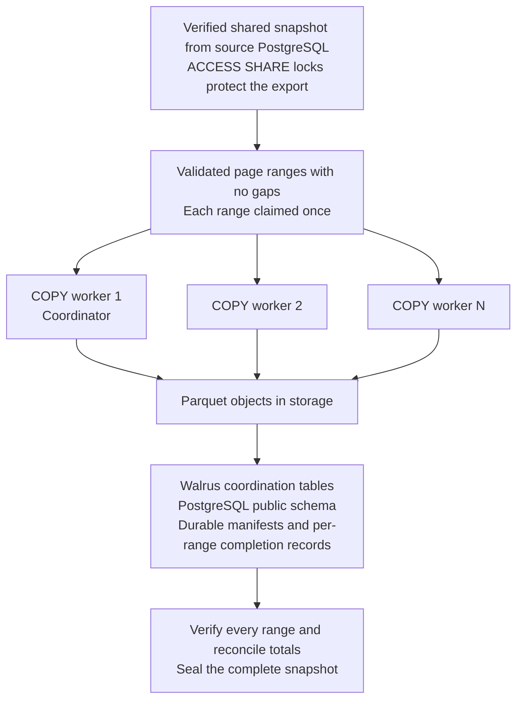
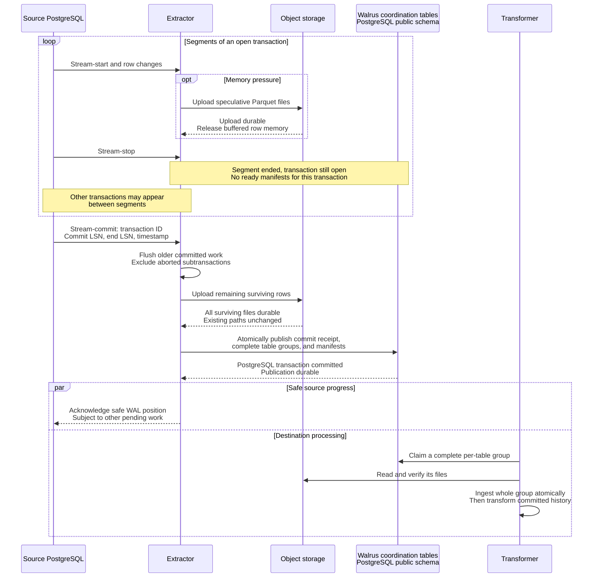
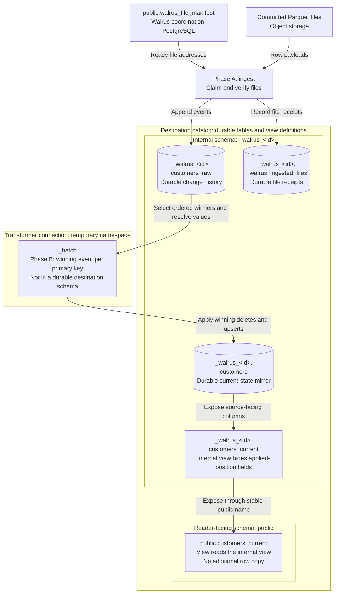
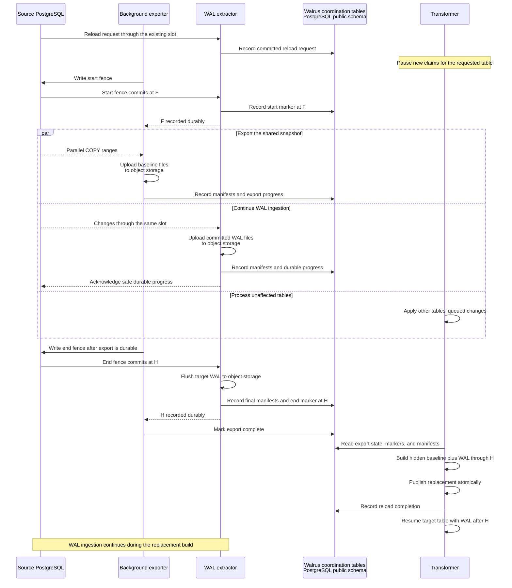

# How Walrus replicates PostgreSQL tables

Walrus separates capturing source changes from applying them to a destination. The extractor reads
PostgreSQL's write-ahead log (WAL), converts records through Apache Arrow into Parquet, and writes
those files to object storage. Walrus coordination tables in PostgreSQL record the durable handoff
in `public.walrus_file_manifest`, along with schema, transaction, and reload state. The transformer
consumes that work on a batch cadence and produces a current-state mirror of each source table.

Throughout this guide, "source PostgreSQL" means the database whose tables and WAL are being read.
"Walrus coordination tables" means the PostgreSQL tables that track replication work and progress,
not another database technology. The source and coordination PostgreSQL connections are configured
independently; the diagram labels distinguish their roles without prescribing a server layout.
The exported and streamed record payloads live in Parquet files in object storage, while the
coordination tables store their manifests and processing state. Coordination table names below
include their PostgreSQL `public` schema; that namespace belongs to the coordination connection,
not automatically to the source database or the destination catalog.

The transformer retains a raw change history, resolves the latest state of each primary key, and
applies the resulting changes to the mirror. It tracks durable ingestion and transformation
progress separately so retries and table reloads can be coordinated independently of WAL
extraction.

## 1. Faster full reloads through parallel COPY

A full reload divides a table's export among several PostgreSQL COPY workers. For ordinary heap
tables, Walrus uses CTID, PostgreSQL's physical tuple location, to divide the table into disjoint
page ranges. Each COPY reads its assigned range. The range plan covers the table without requiring
a primary-key sort or repeated pagination through earlier rows.

The workers share one consistent view of the source. A coordinator opens a read-only,
repeatable-read transaction and exports its snapshot. Additional workers import that exact
snapshot before copying data, and the coordinator participates as a worker too. Concurrent source
changes therefore cannot make different workers observe different versions of the table. Snapshot
transactions also hold `ACCESS SHARE` table locks, which block conflicting DDL while permitting
ordinary row writes.

For larger tables, Walrus creates more ranges than workers and distributes them through a shared
queue. Workers that finish a range take another, spreading uneven work caused by differences in
row width or page occupancy. Workers use ordinary SQL connections, without additional replication
slots. Non-heap tables use a single full-table COPY when physical range splitting is unavailable.

Rows travel through binary COPY into small Arrow batches and then multipart Parquet uploads.
Workers await storage writes before continuing to consume source rows. Output objects can contain
many small batches, so choosing a larger file size does not require buffering that whole file in
memory. Each completed object's manifest and export-progress record are committed together after
the object is durable.

### Why splitting the table does not lose rows

The completeness guarantee combines physical coverage, a consistent visibility snapshot, and
durable completion tracking. Every row version visible to that snapshot belongs to exactly one
range, and every planned range must finish before Walrus accepts the baseline.

1. The range boundaries cover the whole table without gaps or overlap. A CTID identifies a heap
   page and a tuple position within that page. Walrus splits at page boundaries: the lower bound
   is inclusive and the upper bound is exclusive. The first range starts at page zero, and each
   following range starts exactly where the previous one ends. For example, three ranges might
   cover pages 0 through 99, pages 100 through 199, and page 200 onward. Every tuple on page 100
   belongs to the second range. Walrus validates this contiguous plan when recording it in its
   PostgreSQL coordination tables, before COPY starts. The final range has no upper bound, so the
   export does not depend on the table's measured physical size remaining unchanged while workers
   run.

2. Every worker reads the same PostgreSQL row versions. Separate repeatable-read transactions
   alone would be insufficient because each could establish a different snapshot. Walrus exports
   the coordinator's snapshot, imports it into every additional worker, and verifies the imported
   snapshot identity. All workers are prepared before any COPY begins. PostgreSQL's multiversion
   concurrency control, or MVCC, keeps the older row versions needed by these active snapshots
   available, including against ordinary vacuum cleanup. If another transaction updates a row
   onto a different page, the workers still see its original snapshot-visible version in its
   original range. A deletion committed after the snapshot also leaves that version visible to
   the export; an insertion committed after the snapshot is excluded. The coordinator holds its
   transaction open until the other workers finish. Walrus also checks publication coverage and
   row security so a filtered export cannot silently stand in for a full-table baseline.

3. Each range has an explicit, durable completion record. Before workers start, Walrus persists
   the snapshot identity and the entire range plan in its PostgreSQL coordination tables, with
   range entries in `public.walrus_table_reload_export_range`. Workers claim ranges atomically
   from the shared queue, so two workers cannot claim the same range within an attempt. A range
   becomes complete only after its COPY stream ends successfully, its final buffered rows are
   uploaded, and all its object manifests are committed. Even an empty range must record
   completion with zero rows and files.
   Sealing the export requires every planned range to be complete under the current exporter
   ownership, and the summed row and file counts must agree with the durable manifests and export
   counters. Reaching the end of one worker's stream cannot mark the whole table complete.

4. An interrupted export cannot publish a partial baseline. A failed worker causes the remaining
   workers to be cancelled, and missing completion records prevent the export from being sealed.
   Each object's upload finishes before its manifest and progress are recorded together. A crash
   in that interval can leave an unreferenced object, but cannot record unfinished data as durable.
   If recovery has lost the source snapshot and no durable end marker exists, it starts a fresh
   attempt with a new snapshot. Mixing completed ranges from the old snapshot with new ranges from
   a later snapshot would break consistency, so those old ranges are superseded. The transformer
   publishes only a completed replacement.

5. WAL captures changes outside the snapshot's visibility. A complete snapshot represents the
   source at one visibility point. An insert into a range that has already been copied still
   reaches Walrus through the existing WAL stream. The start marker precedes the snapshot, and
   the end marker follows the durable export. Walrus combines the baseline with committed changes
   between those markers before publishing, as described in section 4. Changes committed after
   the end marker follow the normal WAL path. This also covers transactions that were open when
   the snapshot was taken and became visible only after committing.

### How the table lock protects the export

The coordinator explicitly acquires an `ACCESS SHARE` lock on the source table before validating
its structure and exporting the snapshot. Each additional worker imports the snapshot and acquires
the same table lock before COPY starts. These locks last for the source transactions, across all
their COPY ranges and uploads. The coordinator commits last, after all workers finish, so the
table remains protected throughout the parallel scan.

`ACCESS SHARE` conflicts with `ACCESS EXCLUSIVE`. DDL requiring that exclusive lock must wait for
the export transactions to release their locks. This includes adding or dropping columns,
dropping the table, truncating it, and physically rewriting it with operations such as VACUUM
FULL. Those operations cannot change the scanned row layout, remove the table's contents, or
rewrite its physical pages underneath the workers. Ordinary inserts, updates, and deletes use a
compatible lock, so they can continue; the shared snapshot and WAL reconciliation handle their
effects.

Worker lock acquisition uses `NOWAIT`. If conflicting DDL is already queued when a worker tries
to acquire its lock, setup fails and the shared export attempt is abandoned. This avoids waiting
behind a DDL operation that is itself waiting for the coordinator's lock. No worker begins COPY
until every additional worker has successfully imported and verified the snapshot and acquired
its lock.

PostgreSQL does allow some DDL under compatible lock modes, so this is not a blanket prohibition
on every schema or metadata operation. Walrus also uses short `SHARE UPDATE EXCLUSIVE` locks
around start/end fence validation and rechecks the source structure and decoded structural DDL
through the end marker. If a structural change invalidates the frozen schema, the attempt is
rejected and follows the bounded restart path. This covers changes allowed by compatible locks
and changes that commit after the COPY locks are released but before the end fence is established.

### Reload controls

The principal extractor settings are:

| Setting | Default | What it controls |
| --- | --- | --- |
| `max_concurrent_reloads` | 2 | Maximum tables exporting at the same time. |
| `reload_workers_per_table` | 4 | Maximum COPY workers for each table, including its coordinator. |
| `reload_chunk_rows` | 10,000 | Maximum records in each completed reload object. |
| `max_inflight_bytes` | 512 MiB | Budget used for tracked streamed-transaction buffers and reload-worker memory admission. |

These settings live in the YAML document's `extractor` section. Their environment overrides are
`WALRUS_MAX_CONCURRENT_RELOADS`, `WALRUS_RELOAD_WORKERS_PER_TABLE`, `WALRUS_RELOAD_CHUNK_ROWS`, and
`WALRUS_MAX_INFLIGHT_BYTES`; environment values take precedence over YAML.

Setting workers per table to one serializes that table's COPY work. The table limit multiplied by
the worker limit gives the maximum configured COPY concurrency: eight workers with the defaults.
Small tables and memory admission can reduce actual concurrency. Output-file row limits control
file sizing separately from the number of COPY statements; range endings and internal metadata
limits can produce smaller files.

Parallelism uses available source, network, and storage capacity. More workers also add source
connections and competing work, so speedup depends on where the workload is constrained.

## 2. Streaming large transactions before commit

The replication connection requests pgoutput protocol version 2 with streaming enabled. This
allows PostgreSQL to send segments of a large transaction while it is still open. Once its
logical-decoding buffer exceeds `logical_decoding_work_mem`, PostgreSQL can stream changes between
transaction start/stop markers and eventually send a commit or abort outcome.

The earlier protocol-v1 approach delivered transactions after the source had committed. It still
used transaction begin and commit messages; neither version means one transaction must arrive in
one network message. The important change in v2 is that received rows may still be uncommitted.
Walrus can stage them early, but must wait for PostgreSQL's explicit outcome before releasing them
to the transformer. Walrus observes the source application's commit; it does not decide when that
application commits.

### What arrives, and what a staged row contains

A streamed transaction arrives as one or more segments. Each starts with a stream-start message
identifying the top-level transaction and whether this is its first segment. Relation messages
describe the source table and its columns; change messages carry operations and tuple values.
A stream-stop message closes only that segment. Other transactions can appear before a later
segment resumes the same transaction, so the extractor retains separate state for every open
transaction rather than treating the next block of rows as a new transaction.

Streamed changes also identify their subtransaction, allowing Walrus to associate work with a
savepoint rollback. Source tuples are not necessarily complete row images: deletes may carry only
key values, and updates can indicate that a large column is unchanged without sending its value
again. The extractor preserves these distinctions when converting changes through Arrow into
Parquet.

### Example: what the protocol-v2 messages look like

Consider `public.customers`, identified on the wire by relation ID 16384. Its columns, in order,
are customer ID, name, email, and profile; customer ID is the primary key, and the other columns
are text. Assume primary-key-based replica identity. The table below shows selected decoded
messages from a large transaction, 7001, with most bulk rows and any repeated relation/type
announcements omitted. Customer 202 already exists before it begins.

This is a readable view of the message contents, not JSON sent by PostgreSQL. The wire format is
binary, and tuple values are supplied in the column order established by the relation message,
rather than as a named document for every row. IDs, times, and WAL positions are illustrative;
LSNs use PostgreSQL's readable notation here.

| Arrival | Message | Representative contents |
| --- | --- | --- |
| 1 | Stream start | Transaction ID 7001; first segment: yes. No final commit position or timestamp yet. |
| 2 | Relation | Transaction ID 7001; relation ID 16384; table `public.customers`; ordered column definitions and primary-key identity. |
| 3 | Insert | Transaction ID 7001; relation ID 16384; new values: customer 101, name "Alice", email "alice@example.com", profile containing a long biography. |
| 4 | Stream stop | No payload. This segment ends, but transaction 7001 remains open. |
| 5 | Ordinary begin | Transaction ID 7003; final LSN `0/2000`; commit timestamp 10:00:01 UTC. This smaller transaction is being delivered after its source commit. |
| 6 | Insert | Relation ID 16384; new values: customer 404, name "Cara", email null, profile null. The enclosing ordinary transaction identifies this as 7003; there is no streamed transaction-ID prefix. |
| 7 | Ordinary commit | Commit LSN `0/2000`; end LSN `0/2030`; timestamp 10:00:01 UTC. Closes the ordinary transaction 7003, not the still-open transaction 7001. |
| 8 | Stream start | Transaction ID 7001; first segment: no. Resume the transaction from arrival 1. |
| 9 | Update | Transaction ID 7001; relation ID 16384; new values: customer 101, name "Alice, updated", email null, profile marked unchanged. No old-key tuple is needed because the key did not change. |
| 10 | Delete | Transaction ID 7001; relation ID 16384; old-key tuple identifies customer 202. No new row values. |
| 11 | Stream stop | No payload. Transaction 7001 is still waiting for its outcome. |
| 12 | Stream commit | Transaction ID 7001; commit LSN `0/3000`; end LSN `0/3030`; timestamp 10:00:02 UTC. The surviving changes from both segments belong to this commit. |

Protocol v2 supports both delivery forms on the same connection: the large transaction uses
streamed segments, while the smaller transaction can still use ordinary begin/change/commit
messages. Neither of the two stream-stop messages commits transaction 7001. Walrus may spill its
rows before arrival 12, but cannot publish them as ready work until that explicit stream commit
arrives and the durable handoff is complete.

The update also shows why values need interpretation. Email null means clear the email value.
Profile unchanged means retain the previous biography, not clear it. The delete identifies a row
to remove; absent non-key values do not turn it into an update that sets those columns to null.

Savepoint rollbacks carry a different shape: a stream-abort message names both the top-level
transaction and the aborted subtransaction. If a change inside transaction 7001 carried
subtransaction ID 7002, an abort naming top-level 7001 and subtransaction 7002 would exclude only
7002's work. An abort naming 7001 in both fields would discard the whole transaction instead.

### How those changes look in staged Parquet

Walrus adds its own metadata after decoding; `walrus_extractor_meta` is not a field PostgreSQL
sends in those protocol messages. Each Parquet row contains source columns plus that JSON
metadata column. For Alice's inserted row, the source columns hold customer 101, "Alice",
"alice@example.com", and the biography, while selected metadata looks like this:

| Metadata field | Illustrative value for Alice's inserted row | What it tells the transformer |
| --- | --- | --- |
| `op` | `i` | This record is an insert. The later update and delete carry `u` and `d`. |
| `source_schema`, `source_table`, `schema_version` | `public`, `customers`, version 3 | Which table and structural column layout encoded the row. The version is assigned by Walrus, not supplied as such by pgoutput. |
| `xid` | 7001 | The transaction or subtransaction that produced the change. A row from the hypothetical savepoint would carry 7002 instead. |
| `lsn` | `0/1100` | This individual change's position, obtained from its enclosing WAL transport message, not an LSN field inside the insert message. |
| `commit_lsn` | Spill file: `0/1000`; committed manifest: `0/3000` | The file keeps its provisional first-segment position. The committed manifest supplies the real position for downstream ingestion. |
| `unchanged_toast` | Empty or omitted for this insert; identifies `profile` for the later update | Which large values were marked unchanged rather than supplied again. |
| `epoch`, `batch_id` | Epoch 7 and the Parquet batch's UUID | The replication generation and batch containing this record. |

For Alice's later update, both the email and profile data columns are physically null in Parquet,
but `unchanged_toast` identifies profile as an omitted unchanged value. That metadata tells the
transformer to retain the biography while actually clearing the email.

The example assumes the first stream-start arrived at WAL position `0/1000`. Stored metadata
encodes LSNs as zero-padded hexadecimal strings, as described in the file-path explanation below.
The displayed positions above are human-readable equivalents, not a literal dump of the JSON.

Before commit, the individual change's WAL position is known, but the final commit position and
time are not. Speculative files therefore contain provisional commit metadata. Their embedded
commit position uses the transaction's first streamed-segment position, and their embedded commit
timestamp reflects spill time. The final commit position and timestamp are recorded in Walrus's
PostgreSQL coordination tables when the source reports the commit; the original Parquet files are
not rewritten.

### How staging relieves memory and how file paths work

Protocol v2 supplies the opportunity to process incrementally; Walrus's spill path supplies the
memory relief. As tracked memory crosses the configured budget, the extractor selects large open
buffers and writes speculative Parquet files to object storage. Spill files are separated by table,
subtransaction, and structural schema version, so a rolled-back savepoint can be excluded without
discarding its parent's surviving work. The extractor releases buffered rows after the upload
succeeds, retaining transaction state and references to the files. A segment is not necessarily a
file, and a transaction can span many files and tables.

Object addresses follow the shape
`s3://<bucket>/<epoch>/<source-schema>/<source-table>/<lsn>-<uuid>.parquet`.
The epoch namespaces a replication generation, and the schema/table directories organize its
objects by source table. The filename combines a zero-padded, 16-digit hexadecimal WAL position
with a unique file identifier, allowing multiple files for the same table and position.

For ordinary committed WAL batches, that position is the batch's ending commit LSN. For a
pre-commit spill, it is the provisional first-segment position described above. A spill keeps the
same path after commit: there is no move from an uncommitted directory to a committed directory,
and no re-upload simply to change the filename. The manifest records the authoritative commit LSN
alongside the existing object address. The transformer uses that manifest position when ingesting
spill rows, rather than their provisional embedded commit position. A filename is an address, not
proof of commit or a reliable global ordering of transactions.

### How Walrus knows the transaction is complete

Only an explicit stream-commit message establishes that the source transaction committed. It
identifies the top-level transaction and supplies its commit LSN, the WAL position immediately
after the commit record, and the actual commit timestamp. Stream-stop, an idle interval, a batch
size threshold, and a successful file upload are all insufficient: more segments or an abort
could still follow.

The handoff then proceeds through distinct source-commit, durable-publication, and destination
application boundaries:

1. The extractor matches the commit to a known open transaction whose current segment has ended.
   It first flushes older committed batches, including smaller transactions received between this
   transaction's segments. That prevents a later commit from becoming ready ahead of earlier
   committed work still buffered in the extractor.

2. It collects the surviving spill files and uploads any surviving rows still in memory. Every
   resulting manifest entry receives the real commit LSN, including entries for files written
   before commit. Already-aborted subtransactions are excluded.

3. After all those objects are durable, one PostgreSQL transaction updates the Walrus coordination
   tables: it records the source commit in `public.walrus_stream_txn_publication`, creates per-table
   groups in `public.walrus_stream_manifest_group`, and inserts their file entries into
   `public.walrus_file_manifest`.
   Related schema changes are published in that same transaction. Each group records its expected
   files, row total, and file positions. Either the complete publication becomes visible or none
   of it does. Before this point, speculative objects have no ready manifest entries; the
   transformer does not discover work by scanning storage directories.

4. Durable publication allows the extractor to remove this transaction's acknowledgment
   constraint and advance feedback toward the position after its commit record, subject to other
   pending work. It does not wait for the transformer to apply the transaction. The durable handoff
   is what separates source WAL progress from destination processing.

5. Independently, the transformer claims a complete per-table group and validates its membership
   and totals. The group remains indivisible even when it exceeds the normal files-per-poll limit.
   All its files enter that table's raw history together in a destination transaction, along with
   ingestion receipts. Subsequent transformation therefore cannot observe only the first few files
   of that source transaction for the table. This is a per-table guarantee, not a promise of
   simultaneous visibility across every destination table touched by the source transaction.

If PostgreSQL reports a whole-transaction abort instead, the extractor discards its buffered work
and attempts to delete its speculative objects without publishing them. A savepoint abort removes
only that subtransaction's work. Even if object cleanup fails, the lack of ready manifest entries
keeps abandoned files out of the transformer. If publication succeeds but the source acknowledgment
is lost, the durable commit receipt lets a replay recognize the already-published transaction
without publishing it twice.

### Memory relief is separate from WAL acknowledgment

The two memory settings serve different systems: `logical_decoding_work_mem` controls PostgreSQL's
decoding buffer, while `max_inflight_bytes` controls Walrus's tracked buffering and reload
admission. WAL batch thresholds also include `max_rows`, `max_bytes`, and `max_fill`, defaulting to
100,000 rows, 128 MiB, and five seconds. These are buffering controls, not a hard limit on total
process memory. Individual large values, conversion buffers, and bookkeeping still need headroom.

Freeing extractor memory and releasing PostgreSQL WAL are separate steps. An open streamed
transaction keeps acknowledged progress at a safe position preceding its first segment, even if
its speculative files are already stored remotely. Once the outcome and required durable work
are handled, that constraint can lift. After a crash, PostgreSQL can therefore replay an
unfinished transaction completely. The design avoids retaining its entire row history in memory,
but an unfinished transaction can still cause WAL retention on the source.

## 3. Correct results when batched changes affect the same primary key

Walrus flushes and processes changes in batches rather than applying each incoming record
immediately to the destination mirror. Several changes for the same primary key can therefore
accumulate before one transformer pass. A key might be inserted, deleted, and inserted again, or
deleted, reinserted, and deleted again, all within that batch. The transformer must preserve what
those ordered changes mean when applying them together.

### The tables a change passes through

The transformer separates ingestion from reconciliation. First it reads committed Parquet files
identified by the ready manifests and durably appends their records to a raw history table.
Later, it reduces the pending history into one decision per primary key and applies those
decisions to the current-state mirror. These are destination-side data structures, distinct from
the Walrus coordination tables in PostgreSQL described earlier.

The objects do not all live in the same schema. Here, "schema" means a namespace, not a column
layout. For source table `public.customers`, Walrus creates a generated internal destination schema
named `_walrus_<id>`. The `<id>` represents a stable identifier derived from the source schema and
table name; every occurrence below represents that same identifier for this customer table.
Another source schema/table pair gets a different internal schema.

The raw table, mirror, internal view, and destination bookkeeping share `_walrus_<id>`. The public
reader view lives in the destination's `public` schema. The temporary `_batch` table belongs to
the transformer connection's temporary namespace, not either durable destination schema. Source
`public.customers` and destination `public.customers_current` therefore have the same schema name
but are objects in different systems; the destination view does not query the source PostgreSQL
table.

| Schema-qualified object or explicit temporary scope | Type | What it contains or exposes |
| --- | --- | --- |
| `_walrus_<id>.customers_raw` | Durable change-history table in the internal destination schema | Source values and replication metadata for every ingested event, including inserts, updates, and deletes. The same customer ID can appear many times; this is not the current customer list. |
| Connection-local temporary namespace: `_batch` | Temporary working table, outside the durable destination schemas | One winning event per primary key in the transformation window, with omitted unchanged values resolved. A winning delete remains a delete here. This table is rebuilt for each transformation pass, not retained as another history layer. |
| `_walrus_<id>.customers` | Durable current-state mirror table in the same internal schema as the raw table | The surviving row for each primary key after the batch's decisions are applied, plus hidden applied-position metadata used to reject stale changes. Deleted keys have no row. |
| `_walrus_<id>.customers_current` | Internal view in that same destination schema | Reads `_walrus_<id>.customers` and hides its applied-position fields. It stores no separate copy of the customer rows. |
| `public.customers_current` | Reader-facing view in the destination's `public` schema | Reads `_walrus_<id>.customers_current`, giving consumers a stable source-shaped name without exposing the generated internal namespace. It also stores no separate row copy. |

During ingestion, source columns and `walrus_extractor_meta` enter `_walrus_<id>.customers_raw`,
with commonly used operation and ordering fields also exposed as dedicated columns. The
transformer commits the raw append together with file receipts in
`_walrus_<id>._walrus_ingested_files`, a durable bookkeeping table in the same internal destination
schema. That ledger answers "have these exact files already been ingested?"; it is not another
table that customer rows pass through.

During reconciliation, the transformer builds `_batch` and applies its winning deletes and
upserts to `_walrus_<id>.customers` within one destination transaction. A row is not moved out of
`_walrus_<id>.customers_raw` when it is applied: retained history remains available until eligible
for cleanup. Readers see the resulting customer state through `public.customers_current`, which
forwards to `_walrus_<id>.customers_current` and ultimately reads `_walrus_<id>.customers`.

Supporting tables track state alongside that data path. `_walrus_<id>._walrus_meta` holds
destination-side metadata such as the applied schema version. Separately, in the PostgreSQL
coordination connection's `public` schema, `public.walrus_transformer_checkpoint` records how far
raw ingestion has committed and how far mirror transformation has committed. Each position
advances only after its corresponding destination work succeeds. Having records in
`_walrus_<id>.customers_raw` therefore does not yet mean they are visible through the destination's
`public.customers_current`.

### How a batch chooses each key's final state

For each complete primary key, including composite keys, the transformer selects the latest
event. It orders events by transaction commit position first, then by the individual change's WAL
position. That second position distinguishes multiple changes within one transaction, where every
record shares the same commit position. Physical file order or the order in which rows were
appended does not determine the winner.

### Example: six incoming changes, two final decisions

Consider a customer table whose primary key is customer ID. Before the batch, customer 101 does
not exist and customer 202 exists with the name "Bob". The following records arrive in source
change order and are included in one transformer pass. In this example, they belong to one
committed source transaction, so they share the same commit position; the change-order numbers
stand in for increasing individual change LSNs. A dash means the delete carries only the key,
not a replacement name. All non-delete events in this example are source inserts: the replacement
names "Robert" and "Alicia" are data values, not indications of an UPDATE operation.

| Change order | Customer ID | Operation | Name carried by the record |
| --- | --- | --- | --- |
| 1 | 101 | Insert | Alice |
| 2 | 202 | Delete | — |
| 3 | 101 | Delete | — |
| 4 | 202 | Insert | Robert |
| 5 | 101 | Insert | Alicia |
| 6 | 202 | Delete | — |

All six records enter `_walrus_<id>.customers_raw`; batching does not discard the intermediate
events. The transformer then groups them by primary key and creates two winning rows in the
connection-local temporary `_batch`, including the winning delete:

| Customer ID | Its changes within this batch | Winning row in temporary `_batch` | State in `_walrus_<id>.customers`, exposed through destination `public.customers_current` |
| --- | --- | --- | --- |
| 101 | Insert at 1, delete at 3, insert at 5 | Record 5: insert | One row named "Alicia". |
| 202 | Delete at 2, insert at 4, delete at 6 | Record 6: delete | No row for customer 202. |

For these two customer IDs, the path is six new history rows in `_walrus_<id>.customers_raw`,
two decisions in connection-local temporary `_batch`, and one surviving customer row in
`_walrus_<id>.customers`. The internal `_walrus_<id>.customers_current` view and the public
`public.customers_current` view expose that same surviving row without copying it.

This is why batching needs an ordering-aware reduction before applying destination writes.
Applying every insert and then every delete would incorrectly remove customer 101. Applying every
delete and then every insert would incorrectly resurrect customer 202. Selecting only the last
non-delete would also resurrect customer 202. Walrus first determines the final event for each key,
then applies that decision, so the physical grouping of destination writes cannot change the
result.

The same rule works when a batch contains several committed source transactions: commit LSN
orders transactions, and individual change LSN orders changes within each transaction. The batch
is a processing boundary, not a replacement for those source ordering boundaries.

The transformer applies the winning events as deletes or upserts within one transaction. Resolving
each key before applying changes preserves the source's final result. A primary-key-changing
update is represented as removal of the old key and an update for the new key. When PostgreSQL
omits an unchanged large column, the transformer reconstructs its value from retained history or
the existing mirror.

Existing mirror rows retain hidden applied-position metadata. Updating or deleting those rows
requires a newer source position. The next transformation also re-examines the previous commit
boundary, allowing a later change at the same commit position to be considered. Together these
rules support retries and batches split across transformer passes. The file-ingestion ledger
separately prevents a retried file append from duplicating raw history.

## 4. Reloading tables while WAL ingestion continues

Initial loading and later table reloads use the same background export machinery. Startup
establishes the replication stream and records the source-table inventory, then requests exports
while the extractor consumes WAL. Completing every table's export is not a prerequisite for
reading changes from the slot.

The source PostgreSQL table `public.walrus_reload_event` is an append-only, published table carrying
reload requests and start/end fence events. They travel through the same stream as user changes,
so their decoded commit positions provide ordered reconciliation boundaries. A single-table
request identifies one table; an all-table request carries a frozen target inventory.

The decoder records committed requests in `public.walrus_table_reload`, one of Walrus's PostgreSQL
coordination tables. A background controller claims requests under leases and starts exporters up
to the configured concurrency limit. The exporter waits for boundary events to be observed by the
decoder, while the WAL loop continues independently.

During the reload, normal transformer claims for that table pause. Newly staged files remain in
the durable manifest queue, available for the replacement build. Other tables continue claiming
their own work. The affected table's existing published mirror remains readable during an
ordinary reload, although its freshness is temporarily limited.

Reconciliation proceeds through explicit boundaries:

1. The exporter writes a start fence and waits for its decoded commit position, called F, to be
   recorded durably. It then establishes the shared snapshot used by all COPY workers. Every
   exported baseline row is stamped at F.
2. Snapshot files and their manifests become durable while the extractor continues staging WAL.
   After every planned export range is complete and sealed, the exporter writes an end fence.
3. When the decoder observes that fence's commit position, called H, it flushes the target table's
   buffered committed WAL and records the end marker in `public.walrus_table_reload_marker`.
   The export becomes eligible for publication only after its files and boundary evidence are
   complete.
4. The transformer builds hidden replacement raw and mirror tables. It combines the baseline with
   WAL committed after F through H, using the same latest-event rules described above. Baseline
   rows carry the earlier position, so overlapping WAL wins. Queued history at or before F is
   superseded by the complete baseline.
5. After that work is consumed and transformed, the replacement tables and stable reader views
   switch atomically. Completion releases the table's normal processing path, which consumes WAL
   committed after H.

This overlap is intentional. The snapshot may already contain some changes committed after F;
reapplying their ordered events still converges to the state at H. Deletes remove rows seen by the
snapshot, updates replace their values, and inserts add new keys. Truncation is handled as a
table-wide boundary. A transaction that began before F but commits after H belongs to subsequent
WAL processing, according to its commit position.

Explicit markers also handle empty exports: a table with no snapshot rows can still complete and
replace an old mirror containing stale records. Recovery follows durable evidence. If an exporter
loses its connection-local snapshot before a durable end marker exists, recovery creates a fresh
attempt with a new start fence and snapshot. If the end marker is already durable, recovery can
finish from that evidence. Publication receipts similarly allow recovery after the destination
swap without exposing a partial replacement.

The existing replication slot carries both user changes and coordination events. A later
single-table reload therefore needs no new slot and leaves other tables able to progress.

PostgreSQL acknowledgment depends on durable extraction, independently of destination
transformation. Committed changes can be acknowledged once their objects and PostgreSQL
coordination records are durable, subject to outstanding transaction and batch constraints. This
lets the source release eligible WAL during an export while object storage holds the transformer's
backlog. Source locks, storage throughput, and open transactions still affect progress, but there
is no requirement to retain all intervening WAL merely because a table's replacement is unfinished.
